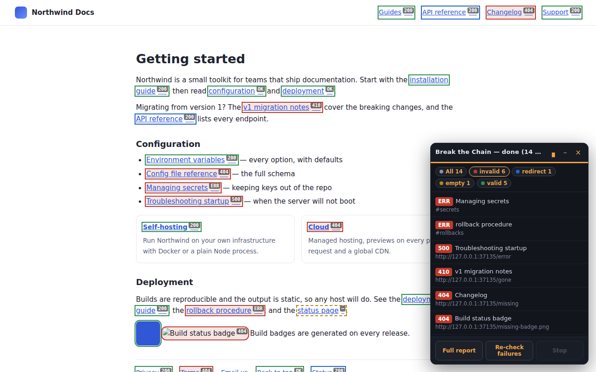

# Break the Chain

[](https://github.com/guyco6742/Break-the-Chain/actions/workflows/ci.yml)
[](LICENSE)


A Chrome extension (Manifest V3) that finds **broken links, dead in-page anchors and redirect chains** — on the page you're looking at, or across a whole site.

Everything runs locally in your browser. No account, no server, no telemetry, nothing to pay for.



## What it does

| | |
|---|---|
| **Checks every reference** | `<a href>`, `<area href>`, and optionally ``, `<script src>` and stylesheets |
| **Sees the whole page** | Walks **shadow roots** and **same-origin iframes**, not just the top-level document — modern component-based sites hide most of their links in there |
| **Resolves in-page anchors locally** | `href="#pricing"` with no `#pricing` on the page is reported as broken, with zero network requests — on the open page *and* on every page a crawl visits |
| **Records the full redirect chain** | `301 → 302 → 301 → 200`, every hop and its status, plus **loop detection** — not just "it redirects" |
| **Crawls the site** | Breadth-first from the current page, seeded by `sitemap.xml`, obeying `robots.txt`, with depth and page caps |
| **Marks up the live page** | Colour-coded outlines and status-code badges, plus a draggable panel that jumps to any finding, cycles corners with one button and remembers where you put it |
| **Exports** | CSV (Excel-safe, UTF-8 BOM) and JSON, honouring whatever filter is on screen |
| **Excludes what you don't care about** | URL patterns (substring, `*` glob, or `/regex/`) and CSS selectors — `header`, `footer`, `nav` |

### Design decisions worth knowing about

- **Heading permalinks are understood.** GitHub, GitLab and most markdown renderers give a heading `id="user-content-slug"` while linking to `#slug`, and bridge the two in JavaScript. Checked literally, every heading permalink on GitHub is a dead anchor; that prefix is resolved, so they are not.
- **`401` / `403` / `429` are warnings, not failures.** They usually mean the resource exists and is refusing an unauthenticated HEAD from an extension. Treating them as broken is the biggest source of false positives in link checkers.
- **A 429 slows the scan down instead of failing the link.** When a host rate-limits us, every queued request for that host is held back for the `Retry-After` it asked for (capped at two minutes) and the URL gets one more try. Without that, a scan can get *your own IP* throttled by the site — and the link you were checking stops working in your browser too.
- **Requests are disguised as navigations.** A `fetch()` from a service worker carries `Origin: chrome-extension://…` and `Sec-Fetch-Mode: cors`, which bot-protection layers in front of Etsy, Amazon and most Cloudflare/Akamai customers read and answer `403` — for URLs that load fine in a tab. `declarativeNetRequestWithHostAccess` rewrites those headers on the extension's own requests only (`tabIds: [-1]`), so nothing you browse is touched.
- **HEAD first, GET as a fallback.** Plenty of servers answer `405` to HEAD. The GET fallback aborts as soon as the headers arrive, so a 200 MB PDF costs headers, not 200 MB.
- **`chrome.webRequest` is used purely as an observer.** `fetch(url, { redirect: 'manual' })` returns an opaque response with unreadable headers, and `redirect: 'follow'` collapses the chain into one final URL. Observing the request is the only way to see the actual hops.
- **HTML fetched during a crawl is parsed in an offscreen document.** The MV3 service worker has no DOM, and regex-scraping `<a href>` out of arbitrary HTML follows links inside comments and `<script>` strings.
- **Host access is an *optional* permission.** The extension ships with `activeTab` and asks for `<all_urls>` from a button in the popup, so installing it doesn't hand it your whole browsing history up front.

## Install (unpacked)

```bash
git clone https://github.com/guyco6742/Break-the-Chain.git
cd Break-the-Chain
npm install
npm run build
```

Then in Chrome: `chrome://extensions` → enable **Developer mode** → **Load unpacked** → select the `dist/` folder.

Open any page, press <kbd>Ctrl</kbd>+<kbd>Shift</kbd>+<kbd>L</kbd> (or click the toolbar icon), grant access once, and hit **Scan this page**.

## Development

```bash
npm run dev        # rebuild on change
npm run typecheck  # tsc --noEmit
npm test           # unit + DOM tests (vitest, happy-dom)
npm run test:e2e   # loads the built extension in Chromium and scans a fixture site
npm run zip        # build + package for the Chrome Web Store
```

`npm run test:e2e` spins up a local fixture server containing one of every failure mode — a 200, a 404, a 500, a three-hop redirect chain, a dead anchor, an empty `href`, a broken image and a link buried in a shadow root — loads the real built extension into Chromium, runs a real scan and asserts on the real results. Set `CHROMIUM_PATH` to use a preinstalled browser instead of Playwright's download.

## How it fits together

```
popup ──START_SCAN──► service worker ──executeScript──► content script
                          │                                  │
                          │                          collects <a>//…
                          │                          across shadow DOM + iframes
                          │◄─────────PAGE_REFS───────────────┘
                          │
                  TaskQueue (global + per-host concurrency, politeness delay)
                          │
                    checker.ts  ──HEAD, then GET──►  the internet
                          │            ▲
                          │            └── RedirectTracker (chrome.webRequest observer)
                          │
                          ├──RESULT──► content script (highlight + panel)
                          └──PROGRESS─► popup / report page
```

Site crawl adds `crawler.ts` (BFS + `robots.txt` + `sitemap.xml`) which fetches each page and hands the HTML to an **offscreen document** for real `DOMParser` parsing.

| Path | What lives there |
|---|---|
| `src/core/` | Pure, dependency-free logic — URL normalisation, exclusion matching, the queue, status classification, robots/sitemap parsing, CSV/JSON export. All of it unit-tested. |
| `src/background/` | Service worker: scan orchestration, the checker, redirect tracking, the crawler. |
| `src/content/` | Deep link collection, page highlighting, the floating panel. |
| `src/popup/`, `src/report/`, `src/options/` | Extension UI. No frameworks, no jQuery. |
| `tests/` | Vitest — 117 unit and DOM tests, run on Node 20 and 22 in CI. |
| `e2e/` | Playwright — the extension running for real in Chromium: a page scan, a site crawl, a clean build output and a clean console. |

## Permissions, and why each one is needed

| Permission | Why |
|---|---|
| `activeTab` + `scripting` | Inject the collector into the tab you explicitly scan |
| `storage` | Your settings, and the last scan's results for the report page |
| `webRequest` | **Observe only** (no blocking) — the only way to see individual redirect hops |
| `offscreen` | A DOM to parse crawled HTML in, which the service worker doesn't have |
| `declarativeNetRequestWithHostAccess` | Rewrite `Origin` / `Sec-Fetch-*` on the extension's **own** requests so bot-protected sites don't false-positive. Scoped to the hosts you granted |
| `<all_urls>` (optional) | Request the URLs found on the page. Granted by you, from the popup, when you first scan |

## When a link is reported as `403` (and it works in your browser)

That's bot protection, not a broken link, and the report says so in the row's note. Large sites fingerprint automated requests and refuse them regardless of what you send. The extension does what it can — browser-shaped headers, a GET fallback, and classifying the result as a **warning** rather than a failure — but a determined WAF wins, and no client-side link checker can beat it.

If a whole domain does this to you, exclude it in the options page and check it by hand.

## Roadmap

- Google Docs / Sheets support (their text isn't in the regular DOM)
- Scheduled monitoring of saved sites, with a diff against the previous run
- `Link:` header and `rel=canonical` checks

## Publishing

[`CHROMEWEBSTORE.md`](CHROMEWEBSTORE.md) holds the store listing copy, the per-permission justifications and the data-use answers. [`PRIVACY.md`](PRIVACY.md) is the privacy policy.

## License

MIT — see [LICENSE](LICENSE).
